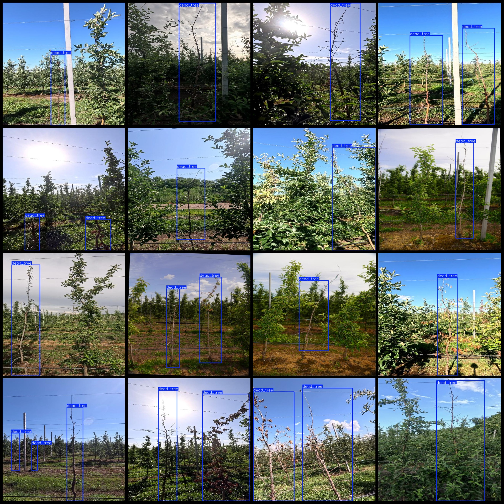
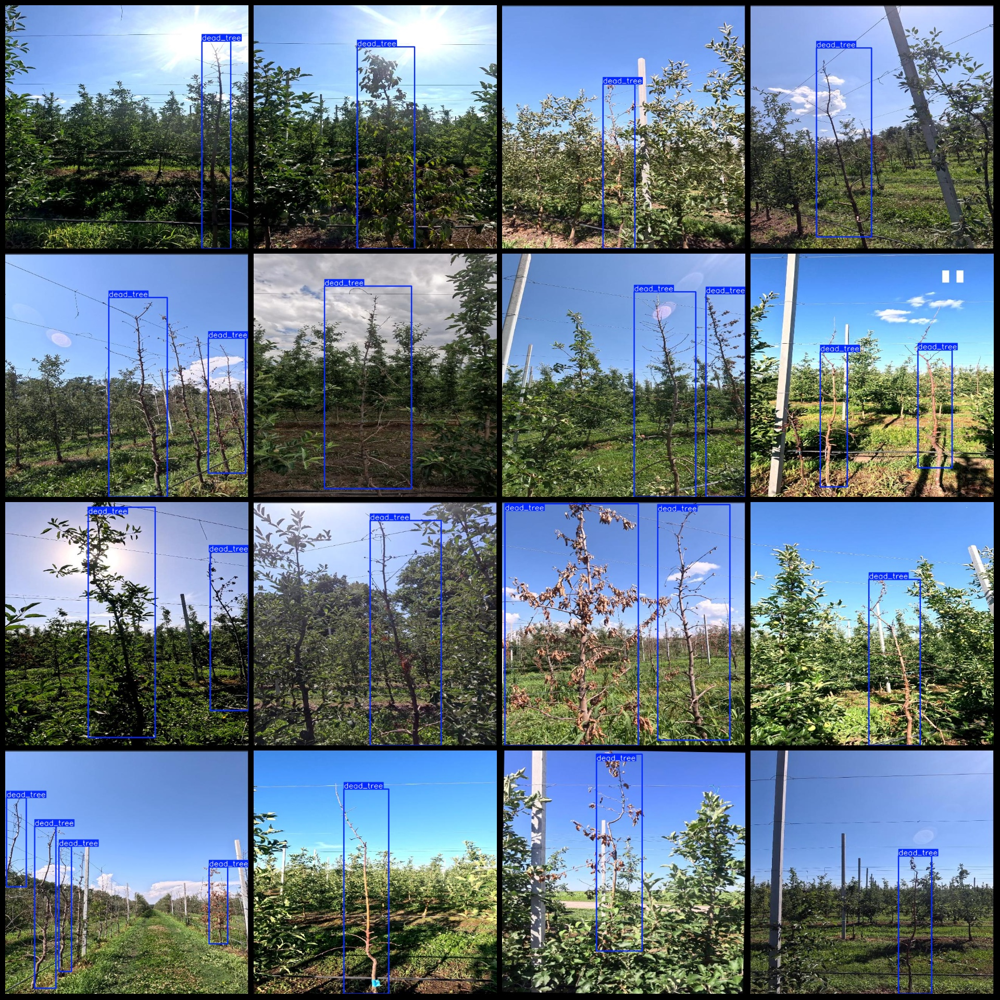

# Intelligent Orchard Apple Tree Death Detection Dataset VOC+YOLO Format: 5184 Images, 1 Category

Dataset Format: Pascal VOC format + YOLO format (without split path in the txt file, only containing jpg images and corresponding VOC format xml files and yolo format txt files)
Number of Images (jpg file counts): 5148
Number of Annotations (xml file counts): 5148
Number of Annotations (txt file counts): 5148
Number of Annotation Categories: 1
Annotation Category Name: ["dead_tree"]
Number of Boxes per Category:  
dead_tree boxes = 7017  
Total number of boxes: 7017  
Number of images each category occupies:  
dead_tree occupies images = 5148  
Image resolution: 640x640  
Annotation Tool Used: labelImg  
Annotation Rules: Drawing a box around the category  
Important Notice: The dataset does not have been split into training, validation, or testing sets. Please do so yourself.
Special Notice: This dataset does not guarantee the accuracy of the trained model or the weight files.
Image Preview:  
Annotation Example:

## Images

Here is a pay link on Stripe ( https://buy.stripe.com/3cs8yP7sY87d0vu9AB ). Please contact me lonlonago@foxmail.com after funding $89, and I will send you a complete data files , thank you!

